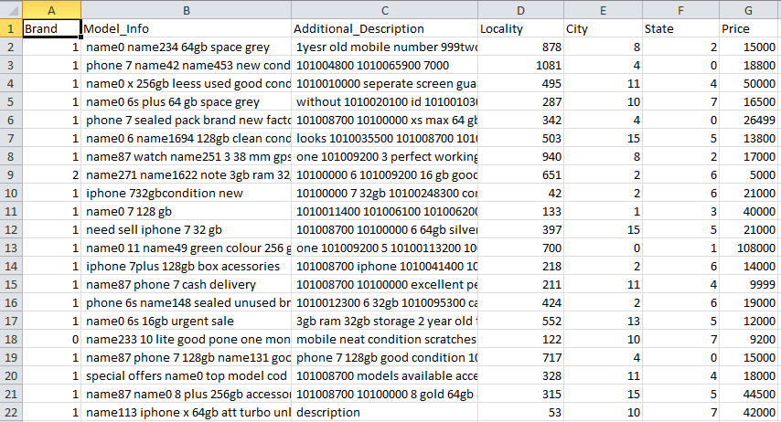

# Used-Electronics-Price-Prediction-Weekend-Hackathon
My approch to the hackathon
Given are 6 distinguishing factors that can influence the price of a used device. Your objective as a data scientist is to build a machine learning model that can predict the price of used electronic devices based on the given factors.

## Data at a Glance

# A Description of my Methodology
#### Feature Engineering & Approach
1. Added New columns like (phone_color,phone_type,brand,ram,rom,etc.) with regarding to the ModelInfo.
2. Added columns of CountVectorizer.
3. Used Default CatboostRegressor for modeling.
4. Implemented SMOTE with the continuous values, taking out the bins of their values as classes
#### Tools used
1. Python for programming
2. sklearn and numpy libraries for methodology
3. catboost library for the model
4. matplotlib and seaborn was used for plotting and analyzing the data
#### Competition Result
Rank: 7th on public LB and 4th on private LB\
[Link](https://www.machinehack.com/course/used-electronics-price-prediction-weekend-hackathon-7/leaderboard)
